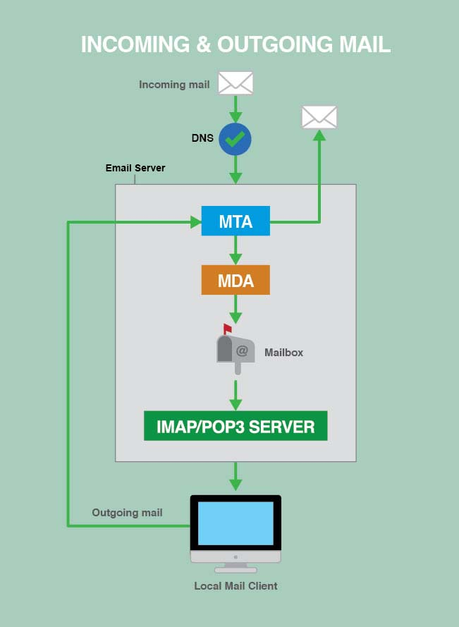

# Benefits of Running Own Email Server

If we want or need full control of our email, running our own mail server might be ideal solution. Doing so allows us to store our own email, access the mail server’s logs, and access the raw email files in a user’s mailbox.

Some benefits of running a mail server are:

* Full control over both the server and your email
* Pick the applications we want to use, and tune them for your needs
* View logs for incoming and outgoing messages
* View logs for connection and authorization attempts from local mail clients for IMAP, POP3, and SMTP

# Drawbacks of Running Own Email Server
* Configuration is complicated
* Downtime can result in lost email
* Spam and virus filtering need to be tuned just right to block unwanted emails and allow legitimate ones
* If a spammer discovers an exploit, they could use our server to send spam, and our IP address could be black-listed
* No third party support to troubleshoot e-mail issues

**Maintaining, upgrading, and troubleshooting the mail server is your responsibility**

# How Mail Servers Work

Every mail server that lets us send and receive email with a local mail client has three separate software components:

* **MTA:** The Mail Transfer Agent relays mail between your server and the wider Internet/LAN, whether it’s delivering an outside email to one of your users, or sending an email from one of your users. Accepted incoming mail gets added to the MTA’s queue on the server.

* **MDA:** The Mail Delivery Agent takes mail from the MTA’s queue and saves it to individual mailboxes on our email server.

* **IMAP/POP3 Server:** Manages users and their mailboxes as they check their email over IMAP/POP3 connections.

# The Mail Server Process
* An incoming message is directed to our server via DNS ( Or Direct IP address in some networks such as LAN).
* Once it passes through the MTA and MDA, it is stored in the user’s mailbox on the server.
* When the message is requested, the IMAP/POP3 server mediates the connection between your server and the user’s local mail client(Roundcube, Squirrelmail, Outlook).
* Outgoing mail is sent from the user’s local mail client, processed by our Server’s MTA, and is then sent to its destination on the Internet/LAN. In LAN, Mostly the destination is our own email server.

# Choosing Mail Server Components

There are several software packages that can be used as MTAs, MDAs, and IMAP/POP3 servers.
We have chosen the following
* Postfix as the MTA
* Dovecot as the MDA
* IMAP/POP3 server.

## Mail Transfer Agents

MTAs are responsible for handling SMTP connections to our email server from both outside senders and our own users. When our email server is asked to relay an email, it decides what to do with the email based on the rules you give it. The MTA delivers the message locally if it is sent to a user you host on our own email server, relays it to another server if it was sent from one of your authorized users, and rejects it if it’s neither to nor from a user on our email server.

**Note:** In Internal LAN, Outside senders or another internal mail server may not present.

Here are the most popular MTA services available:

* **Courier Mail Server** comes with Courier-IMAP, which is the popular part of the Courier mail server suite, but Courier-MTA also includes mail relaying features. It’s a simpler MTA but somewhat limited.
* **Exim** is modern and oriented towards flexibility. It’s secure, but not quite as security-oriented as Postfix. It’s very customizable, but is one of the most complex MTAs to configure.
* **Postfix** is part of Linux server recommended mail server build. It’s modern, security-oriented, and very flexible. It is slightly simpler to set up than Exim.
* **Qmail** is a modern MTAs and supports Maildir-style directories. Qmail has not received an update since 2007, but remains very popular.
* **Sendmail** is a legacy MTA that has a large following and good support.
* **Zimbra** is an all-in-one mail service. Zimbra offers a simple install, but few configurable options.

## Mail Delivery Agents

MDAs move email from the MTA’s queue to individual mailbox directories within our email server, for example: your mailbox could be located at **/var/mail/example.com/user/**. MDAs are also known as Local Delivery Agents (LDAs). Different MTAs support different types of mailboxes. The most common types are the older **mbox mailboxes** which store all the messages together in a single file, and **Maildir mailboxes** which store each email in a separate file and support multiple folders. MDAs are often bundled with other mail-related applications.

These are some of the most popular MDAs available:

* **Cyrus’s MDA** is part of the Cyrus IMAP/POP3 server. Cyrus is a modern, security-oriented IMAP/POP3 server designed to run on servers where users do not log in directly.
* **Deliver** is a simple Linux mail delivery utility that is configured in the Imapd configuration files by default.
* **Dovecot’s LDA** and **Dovecot’s LMTP server** are part of the Dovecot IMAP/POP3 server. Dovecot is a lightweight, modern, and configurable mail server.
* **maildrop** is Courier’s MDA. Courier is an all-in-one mail server.
* **Postfix’s MDA** is part of the Postfix MTA software. Postfix is a modern, security-oriented, flexible MTA.
* **Sendmail’s MDA** is part of the Sendmail MTA software. Sendmail is an older MTA that is still popular.

## IMAP and POP3 Servers

An IMAP or POP3 server handles connections from incoming IMAP or POP3 clients like Microsoft Outlook and Apple Mail. The server manages client access to the mailboxes and raw mail files so that the email is displayed in a modern way.

Most servers and clients support both IMAP and POP3. POP3 clients connect to the server at specified intervals and download all of a user’s messages without leaving copies on the server by default. POP3 was developed when most people used only one device to access one email account. IMAP is a newer protocol designed for multi-device users. IMAP clients stay continuously connected to the server and IMAP mailboxes mirror the mailboxes on our email server. IMAP and POP3 both have secure versions (IMAPS and SSL-POP) which use SSL encryption for mail transfer. Always use the secure version whenever possible.

Here are the most popular IMAP and POP3 servers available:

* **Citadel** is an all-in-one mail service that includes mail, calendars, instant messaging, mailing lists, and other collaboration tools. It’s open source and geared towards small and medium-sized organizations.
* **Courier** has a very popular IMAP server called Courier IMAP. It’s an all-in-one mail server software suite, but Courier IMAP can be installed by itself if that’s the only part you need.
* **Cyrus** is a modern, security-oriented IMAP/POP3 server designed to work on sealed servers where users do not log in directly.
* **DBMail** is an open source project that stores mail in databases instead of flat files.
* **Dovecot** is a lightweight, modern, and configurable mail server, and is part of our recommended mail server build.
* **Xmail** is a full-featured POP3 server, but does not support IMAP.
* **Zimbra** is an all-in-one mail service that’s much simpler to install than other options, but less customizable.

##### Credits

Running a Mail Server[https://www.linode.com/docs/email/running-a-mail-server/]